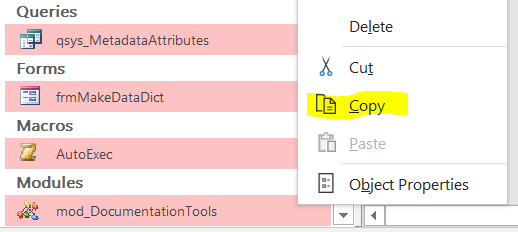
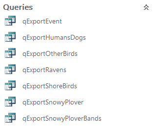

```{r setup, include=FALSE}
library(magrittr)
```
<!-- badges: start -->
[](https://github.com/wright13/imd-fetchaccess-package/actions/workflows/R-CMD-check.yaml)
<!-- badges: end -->


# About this package

The `fetchaccess` R package and Access tool are designed to simplify the process of retrieving data and metadata from an Access database. While this package doesn't create an EML metadata file, it does produce a set of data dictionaries that are compatible with the `EMLassemblyline` package and replace some of the template files it generates which would otherwise be populated manually.

# Installation

Run this code at the RStudio console. You may need to install the `remotes` package first with `install.packages("remotes")`.

```r
remotes::install_github("wright13/imd-fetchaccess-package")
```

# Setup

This R package works in concert with an Access tool. Access table/column metadata can only be accessed via VBA, so the Access tool creates tables and queries with metadata that can then be read into R.

These setup steps take a little bit of time, but they only need to be performed once per database!

## Step 1: Get the template database

After installing the R package, the first step is to retrieve a template database that contains all the components of the Access tool. 

Run the following code to retrieve the template database:

```r
destination_folder <- "C:\\Users\\yourusername\\Documents"  # Change this to wherever you want to save the template db
fetchaccess::getTemplateDatabase(destination_folder)
```

## Step 2: Copy tools from template db to your db



There are six objects that must be copied from the template database to your protocol database:

  - tsys_Units (lookup table for standard EML units)
  - frmMakeDataDict (form for filling in metadata)
  - frmEditLookupInfo (subform)
  - frmEditAttributeInfo (subform)
  - AutoExec (macro for opening frmMakeDataDict when database opens)
  - mod_DocumentationTools (module containing VBA code for metadata retrieval & wrangling)
  
These tools should work in the frontend or backend database. It's generally best to put them in the backend. However, if you have one frontend that connects to *identical* backends, you may want to put the tools in the frontend (and you may want to remove or modify the AutoExec macro).
  
Use **Ctrl + click** to select them all, then right click and select **Copy**. Open your protocol database, then right click anywhere in the navigation pane and select **Paste**.

At this point, you no longer need the template database - it can be deleted. You can always use `fetchaccess::getTemplateDatabase` to retrieve another copy of it if you need it for another project.

## Step 3: Make sure the data are good to go

### Create data export queries in your protocol database



If you haven't done this already, the first step in the process is to create saved Access queries that wrangle your relational database tables into a flat format suitable for CSV export. In general, try not to summarize or perform calculations at this stage. Instead, aim to make each query more or less standalone by including site- and visit-level information like park, site, visit date, etc. Generally, you should also replace integer foreign keys to lookup tables with a meaningful short code as defined in the lookup table.

**This tool works best when your queries are built from tables only, not saved sub-queries. If you absolutely must use sub-queries, be aware that some column descriptions may not be retrieved automatically.**

**You should store date and time information as the appropriate date/time data type in Access, not as text. If your tables store this information as text, consider converting it in your export queries.**

Name your queries with a consistent prefix - this is necessary for automated metadata generation. "qExport" is set as the default, but you may choose a different prefix if this conflicts with an existing naming scheme.

### Fill in some information manually

In the navigation pane of your protocol database, double click on **frmMakeDataDict**. The form should open to the **Start Here** tab. If not, navigate to it. Enter the prefixes of your data export queries and lookup tables. You can edit the form to change the default values of these fields if you like. **If your prefix contains an underscore, e.g. qExport_MyData, make sure you include the underscore when you enter the prefix.**

Click on **Create Metadata**. This will generate some metadata automatically, but for it to create an EML-compatible data dictionary, you will need to fill in some information manually. The good news is that you only need to do this once (but remember to update it if you make changes to your database).

You should see two other tabs called **Add Lookup Info** and **Add Column Info**.

#### Adding lookup info

Ultimately, this table will allow codes and/or ID's in your exported data to be mapped to their definitions.

  1. Go to the **Add Lookup Info** tab in **frmMakeDataDict**. If everything has gone well up to this point, then the **lookupName** column should be populated with the names of the lookup tables in your database.
  2. It may be the case that some of these lookup tables aren't used in the export queries, or the codes are self-explanatory (e.g. "yes/no"). You can delete these rows or skip over them.
  3. There may be tables that you are using as lookups but aren't named accordingly (e.g. "tbl_Sites"). Add rows for these tables.
  4. For each lookup table in the **lookupName** column:
     - determine which column of the lookup contains the values that appear in the export query (usually a primary key or code). Enter the name of that column under **keyColumnName**.
     - determine which column of the lookup clearly defines the meaning of the code or ID. Enter the name of that column under **definitionColumnName**.
  5. You are done adding lookup table info! Just remember to update it if you modify, create, or delete a lookup table in the future.

#### Adding attribute info

This table contains metadata on the columns of your exported data. EML refers to data columns as "attributes", so we'll use that term here. "Columns" will refer to the columns of the metadata tables you see in this Access tool. This metadata has been populated for you where it can be automated, but there is some information you will need to provide manually.

  1. Go to the **Add Attribute Info** tab in **frmMakeDataDict**. The first four columns (**tableName**, **attributeName**, **attributeDefinition**, and **class**) should be fully populated with information about each attribute in each export query. Do not modify or delete any of the data in these columns.
  2. Populate the **unit** column from the dropdown list. Leave it blank for non-numeric attributes (text, Yes/No, and Date/Time). For all numeric attributes, including AutoNumber, you must enter a valid EML unit. Enter "dimensionless" for unitless quantities. See the [EML schema](https://eml.ecoinformatics.org/schema/eml-unittypedefinitions_xsd) for a full list of defined EML units. 
      - If your unit is not present in the dropdown list, enter it anyway. Make sure that it contains no spaces or special characters and that you enter it consistently each time. You will record this as a custom unit later, in the EML generation section of the Data Release Report.
  3. Populate the **missingValueCode** and **missingValueCodeExplanation** columns. You only need to fill these in for non-categorical attributes (i.e. things not associated with a lookup table) that use codes instead of or in addition to blanks to indicate missing data (e.g. -999, "ND"). 
  4. Populate the **lookup** column for attributes whose values come from a lookup table. For all other attributes, leave it blank. The dropdown should show all of the lookup tables found in the **Add Lookup Info** tab. If you had to add or delete lookups, you may need to close **frmMakeDataDict** and reopen it before they will appear in the dropdown.
  5. Populate the **dateTimeFormatString** column for any Date/Time attributes. Choose the format that you would like the data to be displayed and saved in. It is *strongly* recommended that you choose [ISO 8601](https://en.wikipedia.org/wiki/ISO_8601) formatting for your dates and times. Unfortunately, MS Access does not store time zone information. If your data includes times, you may want to add a column to your data table that indicates the time zone using UTC offset or [tz database time zones](https://en.wikipedia.org/wiki/List_of_tz_database_time_zones).

You are all done in Access! Now you can use this R package to read your data and metadata into R.

# Working with your data in R

If you're not an expert in R, don't worry! There is only one step to retrieve your data and export it to flat files.

## Retrieve data from Access

The only function you need to know is called `fetchFromAccess`. You'll need to provide it with some basic information:

  - The path to your Access database (whichever file you copied the Access tools into)
  - The prefix(es) that identify your data export queries
  - The prefix(es) that identify your lookup tables
  
If you want to write the data to flat files, you may also want:

  - The path to the folder you want to store your data exports in (if not provided, defaults to `data/final` in your current working directory)
  - The path to the folder you want to store your data dictionary files in (if not provided, defaults to `data/dictionary` in your current working directory)
  - The path to the folder you want to store your lookup table exports in (not required for EML creation, if not provided, these aren't exported)

```r
database_path <- file.path("C", "Users", "myusername", "myAccessDB.accdb")  # Edit this to point to your database
export_prefix <- "qExport_"  # For multiple prefixes, use the syntax c("prefix", "otherprefix")
lkup_prefix <- "tlu_"  # This also accepts multiple prefixes - see above
export_folder <- file.path("C", "Users", "myusername", "data_exports")  # Hopefully your actual folders are better organized than this!
dict_folder <- file.path(export_folder, "dictionary")

my_dataset <- fetchaccess::fetchFromAccess(db_path = database_path,
                                           data_prefix = export_prefix,
                                           lookup_prefix = lkup_prefix,
                                           save_to_files = TRUE,
                                           data_dir = export_folder,
                                           dictionary_dir = dict_folder)
```

You can further explore the data in R if you want to, and you can use it to further automate the metadata creation process. If you are comfortable in R, check out the documentation (run `?fetchaccess::fetchFromAccess` at the RStudio console) for more data wrangling and customization options.

# Next steps!

See the [NPSDataverse](https://nationalparkservice.github.io/NPSdataverse/index.html) family of R packages for tools to help you finish creating a data package with EML metadata.
