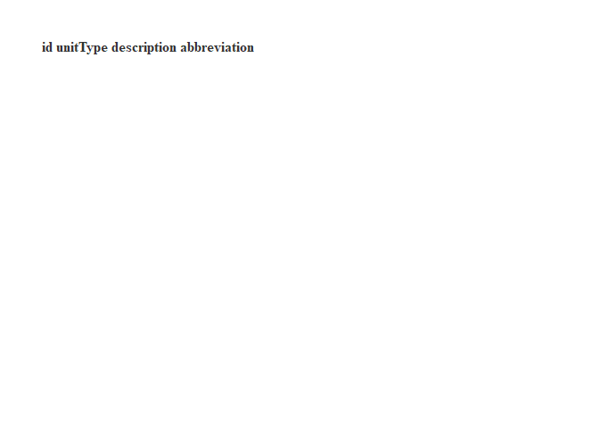

Access/R Data Dictionary Creator
================
Sarah Wright
2022-07-26

# About this package

This R package works in concert with an Access tool. Access table/column
metadata can only be accessed via VBA, so the Access tool creates tables
and queries with metadata that can be read through an ODBC connection.
This package works with 64 bit Access and 64 bit R installations, with
Access databases that are not password protected. Users running 32 bit
Access or R and older versions of Access databases may need to modify
the the tool and R functions.

You can copy the necessary Access objects into your database from the
template database in the `inst` folder of the GitHub repository for this
package, or by running the following after installing the package:

``` r
destination_folder <- "C:\\Users\\yourusername\\Documents"  # Change this to wherever you want to save the template db
getTemplateDatabase(destination_folder)
```

The only R function in this package that you need is
`fetch_from_access()`. Given the path to your database, the prefixes
that indicate export queries and lookup tables in your database, and an
optional function that performs any custom data wrangling that you
prefer to do on the R side instead of the Access query side, it will
output a list of data and data dictionary tables. Optionally, it will
also write these tables to csv (data) and tsv (data dictionary) files on
disk. These files are formatted for compatibility with the IMD DRR
Template EML generation tools.

For `fetch_from_access()` to work, you must first complete the following
steps to set up your Access database.

# Setting up your Access database

## Ensure lookup tables are up to date with descriptions

This tool relies on lookup tables containing all the valid values for a
single field. It won’t work properly if your database has a shared
“tlu_enumerations” type table that contains multiple lookups for
multiple fields.

## Create data export queries in your protocol database


If you haven’t done this already, the first step in the process is to
create saved Access queries that wrangle your relational database tables
into a flat format suitable for CSV export. In general, try not to
summarize or perform calculations at this stage. Instead, aim to make
each query more or less standalone by including site- and visit-level
information like park, site, visit date, etc. You should also replace
integer foreign keys to lookup tables with a meaningful short code as
defined in the lookup table.

Name your queries with a consistent prefix - this is necessary for
automated metadata generation. “qExport” is recommended but you may
choose a different prefix if this conflicts with an existing naming
scheme.

## Copy objects from Metadata Generation Template database

Download the Metadata Generation Template database from the `inst`
folder of the GitHub repository for this package, or by running the
following after installing the package:

``` r
destination_folder <- "C:\\Users\\yourusername\\Documents"  # Change this to wherever you want to save the template db
getTemplateDatabase(destination_folder)
```


There are three objects that must be copied from the template database
to your protocol database:

- frmMakeDataDict (form)
- AutoExec (macro)
- mod_DocumentationTools (module)

Use **Ctrl + click** to select them all, then right click and select
**Copy**. Open your protocol database, then right click anywhere in the
navigation pane and select **Paste**.

You are now done with the template database, although it is a good idea
to save it somewhere that you can find it in case any of the objects you
copied are accidentally lost.

## Fill in some information manually

### Step 1

In the navigation pane of your protocol database, double click on
**frmMakeDataDict**. In the form that opens, enter the prefixes of your
data export queries and lookup tables. You can change the default values
of these fields if you would like.

Click on **Create User Editable Table**. This will generate some
metadata automatically, but for it to create an EML-compatible data
dictionary, you will need to fill in some information manually. The good
news is that you only need to do this once (but remember to update it if
you make changes to your database).

You should see a table called **tsys_EDIT_metadataSourceFields**.

Ultimately, this table will allow codes and/or ID’s in your exported
data to be mapped to their definitions.

1.  Double click on **tsys_EDIT_metadataSourceFields** to open it. If
    everything has gone well up to this point, then the **tableName**,
    **attributeName**, **class**, and **DataSize** columns should be
    populated with the names and details of your fields in each export
    query.
2.  For each field, enter the **metadataSourceField**, and
    **metadataSourceTable**. These are the field names and table names
    of where you want the metadata to come from for each field in your
    export query. For instance, if you have a query based on an event
    table, most of the field definitions will probably come from the
    event table, but perhaps the description in the event table for a
    lookup field is something generic like “foreign key to lookup”, then
    you would want to enter the field name/table from the lookup table
    instead.
3.  For each attribute name that is a lookup, fill in the
    **lookupTableName**, **lookupCodeField**, and
    **lookupDescriptionField**. The lookupCodeField should be the same
    field as the values in the export table and may or may not be the
    primary key of the lookup table depending on whether you replaced
    integer foreign keys with short codes in the export query. The
    lookupDescriptionField should be the longer description that helps
    explain the value in the export query.These will show up in the EML
    metadata file as valid values for the attribute field
4.  Save and close **tsys_EDIT_metadataSourceFields**. You are now done
    with this table! Just remember to update it if you create or delete
    a lookup table in the future (or change the definition column name
    of an existing lookup).

### Step 2

Click on **Create Metadata**. This will take all the information you
provided in Step 1 and create another table,
tsys_EDIT_metadataAttributeInfo, with all the correct attribute
descriptions, and updated class column. There are still four columns to
manually fill in this table, but this will only need doing once (unless
you have updated the table from Step 1).

1.  Open **tsys_EDIT_metadataAttributeInfo**. The four columns
    (**tableName**, **attributeName**, **readonlyClass**, and
    **readonlyDescription**) should be fully populated with information
    about each column in each export query. Do not modify or delete any
    of the data in these columns!
2.  Populate the **unit** column. Leave it blank for non-numeric fields
    (text, Yes/No, and Date/Time). For all numeric fields, including
    AutoNumber, you must enter a valid EML unit. Enter “dimensionless”
    for unitless quantities. See below for a full list of valid EML
    units (*use the value in the ID column*) \[Note: download
    README.html to see the list; it does not render properly on
    GitHub\].
    - If your unit is not present in the list below, enter it anyway.
      Make sure that it contains no spaces or special characters and
      that you enter it consistently each time. You will record this as
      a custom unit later, in the EML generation section of the Data
      Release Report.
3.  Populate the **missingValueCode** and
    **missingValueCodeExplanation** columns. You only need to fill these
    in for columns that use codes instead of or in addition to blanks to
    indicate missing data (e.g. -999, “ND”).
4.  (Optional at this stage) Populate the **dateTimeFormatString**
    column. Depending on what data wrangling you do in R, you may wish
    to populate this column in R instead. 5.Save and close
    **tsys_EDIT_metadataAttributeInfo**. You are now done with this
    table! Just remember to update it if you ever update
    **tsys_EDIT_metadataSourceFields** from step 1 in the future!
5.  Close the database.

<!-- -->

# Load the fetchAccess package and run the fetch from access function

Either in the EML R markdown script as part of the data package project
folders, or in a fresh R studio session, load the installed package. the
parameters you need are:

1.  *db_path* is the pathway to the access database used in the steps
    above
2.  *data_prefix* is the prefix for the export queries (default is
    “qExport”)
3.  *lookup_prefix* is the prefix for the lookup tables (default is
    “tlu”)
4.  *tables_to_omit* is a vector of any export query, tsys, or lookup
    table names that you don’t want to import.
5.  *custon wrangler* is the name of any function that you want to do
    extra data munging to the tables after they are imported (optional)
6.  *save_to_files* should be TRUE if you want the data dictionaries to
    be saved to files (defaults to FALSE)
7.  *data_dir* is the path and folder of where you want the final csv’s
    to be exported to (default is ./data/final)
8.  *dictionary_dir* is the path and folder of where you want the final
    data dictionaries to be exported to (default is ./data/dictionary)

``` r
library(fetchaccess)
fetch_from_access(db_path, data_prefix, lookup_prefix, tables_to_omit, custom_wrangler, save_to_files, data_dir, dictionary_dir)
```
